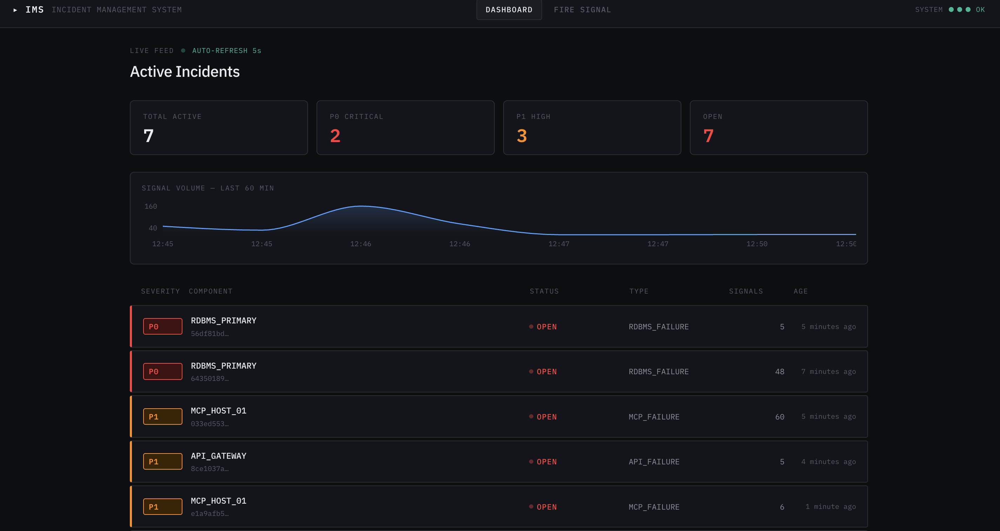

# Incident Management System (IMS)

A mission-critical Incident Management System for ingesting high-volume infrastructure signals, creating debounced WorkItems, storing raw signal history, and driving incidents through a controlled workflow with mandatory Root Cause Analysis (RCA).

The project is async-first throughout and uses purpose-built storage for each concern:

- **FastAPI backend** for signal ingestion and incident APIs
- **asyncio.Queue** for in-memory buffering and fail-open backpressure
- **PostgreSQL** as the source of truth for WorkItems and RCA records
- **MongoDB** as the raw signal data lake and timeseries aggregation store
- **Redis** for debounce keys and dashboard cache
- **React frontend** for live incident feed, detail view, RCA submission, and manual signal firing

---

## Dashboard Preview

<!--
  Screenshot / GIF of the dashboard goes here.
  Suggested filename: docs/assets/dashboard.png
  Markdown:           
-->

*Screenshot will be added here before final submission.*

---

## Architecture Diagram

```mermaid
flowchart LR
    External[External Systems / Signal Producers] -->|POST /api/v1/signals| API[FastAPI Backend]

    API -->|202 Accepted| Client[Producer receives quick response]
    API -->|put_nowait| Queue[asyncio.Queue<br/>maxsize 50,000]

    Queue --> Worker[Background Signal Worker]

    Worker --> Strategy[Alert Strategy Registry<br/>RDBMS / Cache / API / Queue / MCP]
    Strategy --> Worker

    Worker --> RedisDebounce[Redis Debounce Key<br/>debounce:{component_id}<br/>TTL 10s]
    RedisDebounce -->|existing key| ExistingWI[Increment existing WorkItem signal_count]
    RedisDebounce -->|missing key| NewWI[Create new WorkItem]

    ExistingWI --> Postgres[(PostgreSQL<br/>WorkItems + RCA)]
    NewWI --> Postgres

    Worker -->|raw signal + workitem_id<br/>retry with exponential backoff| MongoSignals[(MongoDB<br/>signals collection)]
    Worker -->|per-minute upsert| MongoTS[(MongoDB<br/>timeseries collection)]

    API -->|dashboard cache<br/>30s TTL| RedisCache[(Redis<br/>dashboard:workitems)]
    API --> Postgres
    API --> MongoSignals

    Frontend[React Dashboard] -->|poll every 5s| API
    Frontend -->|status transitions| API
    Frontend -->|submit RCA| API

    API --> StateMachine[State Pattern<br/>OPEN → INVESTIGATING → RESOLVED → CLOSED]
    StateMachine --> Postgres
```

---

## Main Features

### Signal ingestion

- Endpoint: `POST /api/v1/signals`
- Returns `202 Accepted` immediately after placing the signal into an in-memory `asyncio.Queue`.
- The request path does **not** directly write to databases. This keeps ingestion responsive when persistence is slower than incoming traffic.
- The queue is bounded with `QUEUE_MAX_SIZE=50000`.

### Backpressure strategy

The backend uses a bounded `asyncio.Queue` with `put_nowait()`.

When the queue has capacity:

1. The API validates the signal payload.
2. The signal is placed into the queue.
3. The API returns `202 Accepted`.
4. A background worker later processes the signal.

When the queue is full:

1. `put_nowait()` raises `asyncio.QueueFull`.
2. The system logs a warning.
3. The signal is dropped.
4. The API still returns quickly instead of blocking or crashing.

This is a **fail-open** strategy. The priority is keeping the ingestion service alive during bursts. The roadmap includes durable queueing, dead-letter storage, and adaptive rate limits as the system scales to multi-worker deployments.

### Debouncing

Redis is used to debounce repeated signals for the same `component_id`.

- Key format: `debounce:{component_id}`
- Value: `workitem_id`
- TTL: `DEBOUNCE_WINDOW_SECONDS`, default `10` seconds

If another signal for the same component arrives while the Redis key exists, the signal is linked to the existing WorkItem and the WorkItem `signal_count` is incremented.

> **Scope note — single-worker by design.** This assignment intentionally targets a single backend worker process, where signals are processed serially by one asyncio task. The current `GET → create → SETEX` sequence is correct under that scope. **It is *not* safe across multiple worker processes** — under horizontal scaling, two workers could race between the `GET` and the `SETEX` and create duplicate WorkItems.
>
> The fix is well understood: replace the sequence with an atomic `SET NX EX` (single Redis round-trip, returns whether the key was created or already existed). This will be implemented as part of the multi-worker scaling work after the assignment submission. It is left as a deliberate roadmap item rather than rushed in, so the change can land alongside the worker-pool refactor it belongs with.

### Rate limiting

SlowAPI is configured in `main.py`, and the ingestion endpoint has a `@limiter.limit(...)` decorator.

Current setting:

```text
RATE_LIMIT_PER_MINUTE=600000
```

This high value accommodates the bursty signal ingestion scenarios in the assignment. In production, this should be tuned per environment and traffic profile.

### Persistence model

| Data type | Store | Purpose |
|---|---|---|
| WorkItems | PostgreSQL | Source of truth for incident lifecycle state |
| RCA records | PostgreSQL | Transactional RCA data and closure requirement |
| Raw signals | MongoDB | High-volume audit log / data lake |
| Timeseries buckets | MongoDB | Aggregated signal counts by minute/component/severity |
| Dashboard state | Redis | Hot-path cache for active WorkItems (30s TTL) |
| Debounce keys | Redis | Short-lived grouping of repeated component signals |

### Workflow engine

The incident lifecycle uses the State Pattern:

```text
OPEN → INVESTIGATING → RESOLVED → CLOSED
```

Rules enforced by the backend:

- `OPEN` can transition only to `INVESTIGATING`.
- `INVESTIGATING` can transition to `RESOLVED` or back to `OPEN`.
- `RESOLVED` can transition to `CLOSED` or back to `INVESTIGATING`.
- `CLOSED` is terminal.
- A WorkItem cannot move to `CLOSED` unless an RCA exists.
- RCA cannot be submitted for `OPEN` or `CLOSED` WorkItems.
- Duplicate RCA submission is rejected.

### Alert strategy

The alerting logic uses the Strategy Pattern. The worker maps component prefixes to alert strategies:

| Component prefix | Strategy | Priority |
|---|---|---|
| `RDBMS`, `DB`, `POSTGRES` | `RDBMSFailureStrategy` | `P0` |
| `CACHE`, `REDIS`, `MEMCACHE` | `CacheFailureStrategy` | `P2` |
| `API`, `HTTP` | `APIFailureStrategy` | `P1` |
| `QUEUE`, `KAFKA`, `RABBIT` | `QueueFailureStrategy` | `P1` |
| `MCP` | `MCPFailureStrategy` | `P1` |
| Unknown | `DefaultFailureStrategy` | `P1` |

More detail is available in [`docs/DESIGN_PATTERNS.md`](docs/DESIGN_PATTERNS.md).

### MTTR

Mean Time To Repair is automatically calculated and stored when a WorkItem transitions to `CLOSED`.

```
MTTR = rca.submitted_at − wi.created_at
```

- `wi.created_at` — when the first debounced signal created the WorkItem; the earliest point the system was aware of the incident.
- `rca.submitted_at` — when the RCA was submitted; a conservative, auditable end boundary that captures the full incident lifecycle including documentation.

This produces a complete wall-clock MTTR for SLA tracking. The roadmap includes surfacing `rca.incident_end` as a secondary metric so teams can separately distinguish repair time from RCA documentation time.

---

## Setup Instructions

### Prerequisites

- Docker
- Docker Compose

### Start the stack

From the repository root:

```bash
docker compose up -d --build
```

This starts:

- PostgreSQL on `localhost:5432`
- MongoDB on `localhost:27017`
- Redis on `localhost:6379`
- Backend on `localhost:8000`
- Frontend on `localhost:3000`

### Open the application

```text
Frontend:   http://localhost:3000
Backend:    http://localhost:8000
API docs:   http://localhost:8000/docs
Health:     http://localhost:8000/health
```

### Stop the stack

```bash
docker compose down
```

The compose file uses named volumes for PostgreSQL, MongoDB, and Redis. For a completely clean reset:

```bash
docker compose down -v
```

---

## Running Tests

From inside the backend container:

```bash
docker exec -it ims_backend pytest
```

Current tests cover:

- RCA schema validation (time ordering, category whitelist, min-length guards, duplicate prevention)
- State machine transitions (valid paths, invalid paths, terminal state, RCA guard)
- Alert strategy mapping (prefix matching, case-insensitive, default fallback)
- MongoDB retry with exponential backoff
- MTTR calculation formula (rounding, sub-minute, multi-hour)

---

## Sample Data / Signal Simulation

A sample incident simulation script is included at:

```text
scripts/simulate_incident.py
```

Example:

```bash
python scripts/simulate_incident.py
```

You can also use the frontend **SignalFire** page to manually trigger preset incidents such as RDBMS outage, cache failure, API gateway failure, MCP host failure, and queue backlog.

---

## Important API Endpoints

| Endpoint | Method | Purpose |
|---|---:|---|
| `/api/v1/signals` | `POST` | Ingest a signal and enqueue it for async processing |
| `/api/v1/workitems` | `GET` | List active WorkItems sorted by severity |
| `/api/v1/workitems/{id}` | `GET` | View WorkItem detail, linked MongoDB signals, and RCA |
| `/api/v1/workitems/{id}/status` | `PATCH` | Transition WorkItem status |
| `/api/v1/workitems/{id}/rca` | `POST` | Submit RCA |
| `/api/v1/workitems/{id}/rca` | `GET` | Fetch RCA |
| `/health` | `GET` | Check PostgreSQL, MongoDB, and Redis connectivity |
| `/api/v1/metrics/timeseries` | `GET` | Fetch MongoDB timeseries aggregation data |

---

## Roadmap

The following improvements are planned for production hardening:

| Area | Current | Planned |
|---|---|---|
| Debounce atomicity | Single-worker `GET → SETEX` | Atomic `SET NX EX` for multi-worker scaling |
| MTTR granularity | `rca.submitted_at` (full lifecycle) | Add `rca.incident_end` as secondary metric |
| Dashboard cache | Invalidated on creation + status change | Also invalidate on `signal_count` increment |
| Worker concurrency | Single asyncio task | Configurable worker pool with batch processing |
| DB schema migrations | `create_all()` on startup | Alembic migration files |
| Integration tests | Unit tests only | Full API + database integration test suite |

---

## Known Limitations / Deferred Work

The following items are deliberately scoped *out* of the assignment submission for transparency:

- **Debounce atomicity** assumes a single backend worker (see the [Debouncing](#debouncing) section). The atomic `SET NX EX` rewrite is roadmap'd and will land alongside the worker-pool refactor.
- **Database schema is created via `Base.metadata.create_all()` on startup** rather than Alembic migrations. Fine for the demo; not how this would ship to production.
- **Integration tests are limited.** Unit tests cover RCA validation, state machine, alert strategy, MongoDB retry, and MTTR calculation. A full API + DB integration test suite is roadmap'd.

These are surfaced openly because the rubric rewards engineering judgment, and the rationale for each is documented in [`docs/ARCHITECTURE.md`](docs/ARCHITECTURE.md).

---

## Bonus / Creative Additions

Beyond the assignment's core requirements, the following additions were built to strengthen the deliverable:

- **SignalFire page** — a dedicated frontend page (`/signal-fire`) that lets a user manually trigger preset incident scenarios (RDBMS outage, cache failure, API gateway failure, MCP host failure, queue backlog) directly from the UI, with live feedback. Useful for demoing the full pipeline without running the simulation script.
- **Timeseries aggregation visualisation** — a MongoDB-backed per-minute aggregation pipeline (`signal_timeseries` collection) feeds a chart in the dashboard, going beyond the assignment's "support timeseries aggregations" line by actually rendering them.
- **Exponential-backoff retry on MongoDB writes** — the worker retries failed signal writes up to 3 times with `0.5s → 1s → 2s` delays, satisfying the "evidence of retry logic for DB writes" rubric criterion explicitly.
- **Mermaid architecture diagram** rendered inline in the README (instead of a separate image file) — readable directly on GitHub without needing to open another asset.
- **Detailed `docs/` folder** with three companion documents:
  - [`DESIGN_PATTERNS.md`](docs/DESIGN_PATTERNS.md) — Strategy + State pattern rationale.
  - [`ARCHITECTURE.md`](docs/ARCHITECTURE.md) — tech stack rationale and trade-offs (maps to the 10% "Tech Stack choices" rubric line).
  - [`PROMPTS.md`](docs/PROMPTS.md) — the prompts used to scope and build the project (maps to submission rule #4).
- **Health endpoint that probes all three storage backends** (`/health`) — Postgres, MongoDB, and Redis — rather than a static OK response.
- **Throughput metrics logged every 5 seconds** to the console (`[METRICS]` lines) per the assignment's observability requirement.

---

## Project Structure

```text
backend/
  app/
    api/                  # FastAPI routes (signals, workitems, rca, health, metrics)
    core/                 # config and rate limiter
    db/                   # Postgres, MongoDB, Redis async clients
    models/               # SQLAlchemy models (WorkItem, RCA, Signal)
    schemas/              # Pydantic schemas
    services/             # Strategy and State pattern logic
    workers/              # asyncio.Queue and background signal worker
    main.py               # FastAPI app entrypoint
  tests/                  # pytest unit tests
frontend/
  src/
    pages/                # Dashboard, IncidentDetail, SignalFire
    components/           # RCAForm, StatusBadge, SeverityBadge, etc.
scripts/
  simulate_incident.py    # mock signal generator
docs/
  DESIGN_PATTERNS.md      # Strategy + State pattern rationale
  ARCHITECTURE.md         # tech stack rationale and trade-offs
  PROMPTS.md              # prompts used during development
docker-compose.yml
README.md
```